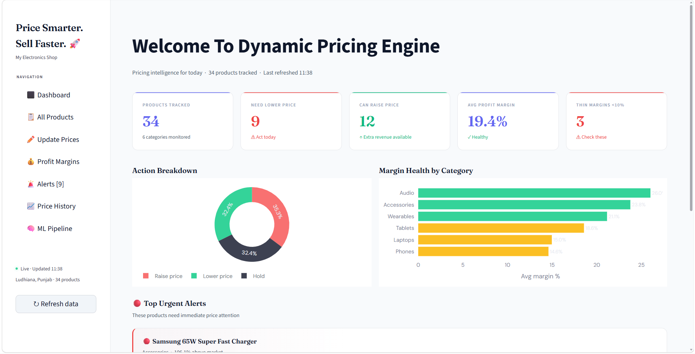
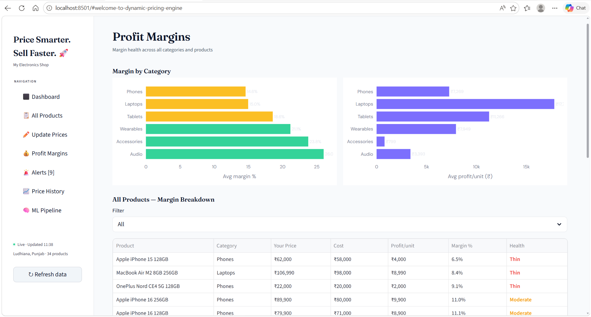
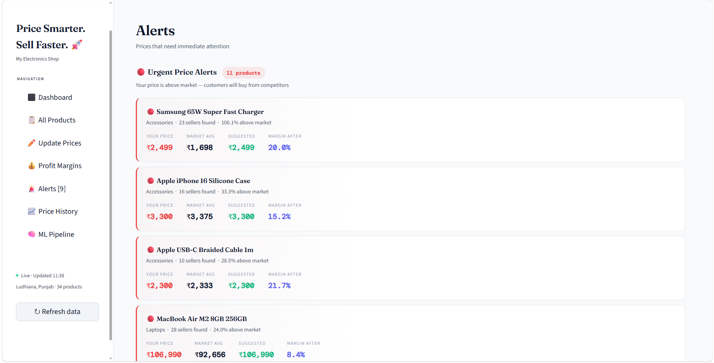
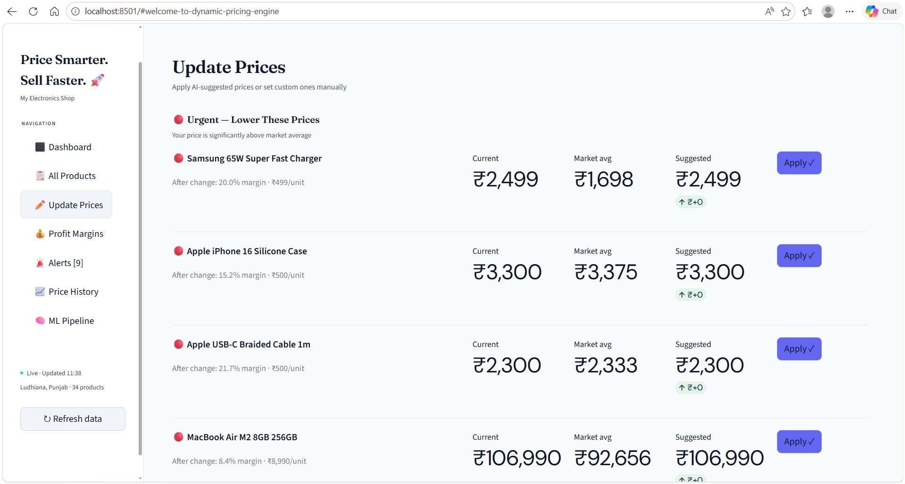

# 🚀 Dynamic Pricing Engine — PriceIQ

### **Price Smarter. Sell Faster. 🚀**

---

## 📖 About

**PriceIQ** is an AI-powered dynamic pricing platform designed to help businesses make intelligent pricing decisions using real-time market signals, machine learning, and automation.

The system analyzes competitor pricing, demand trends, weather signals, and user behavior to recommend optimal pricing strategies that maximize revenue while maintaining fairness and competitiveness.

This project combines **data science, machine learning, and real-time analytics** into a production-style dashboard built using Streamlit.

---

## 📌 Overview

PriceIQ enables businesses to:

* 📈 Dynamically adjust prices based on market conditions
* 💰 Maximize profit margins and revenue
* ⚔️ Stay competitive with real-time competitor tracking
* 🚨 Detect pricing risks and opportunities instantly

---

## ✨ Key Features

* 📊 **Real-Time Pricing Dashboard**
* 🤖 **AI-Based Price Recommendations (RL + ML)**
* 📉 **Profit Margin Analysis**
* 🚨 **Smart Alerts for Pricing Optimization**
* 📈 **Price History Tracking**
* 🧠 **Machine Learning Pipeline (Demand Forecasting + RL Agent)**
* 🌦️ **Weather & Trend-Based Demand Signals**
* 🛒 **Competitor Price Monitoring (SerpAPI)**

---

## 🖼️ Screenshots

### 🏠 Dashboard



### 📊 Profit Margins



### 🚨 Alerts System



### 📈 Update Prices



---

## 🏗️ Project Structure

```
dynamic-pricing-engine/
│
├── app.py                 # Main Streamlit app
├── scheduler.py          # Fetches and updates market data
├── price_manager.py      # Pricing updates & logging
├── pricing_engine.py     # RL-based pricing decisions
├── market_fetcher.py     # API + competitor data logic
├── demand_model.py       # XGBoost demand prediction
├── forecaster.py         # 24-hour demand forecasting
├── config.py             # Configurations & constants
├── products.csv          # Product dataset
│
├── pricing_cache.db      # Cached pricing data
├── demand_model.pkl      # Trained ML model
├── dqn_model.pth         # RL model
│
└── README.md
```

---

## ⚙️ Tech Stack

* **Frontend/UI:** Streamlit
* **Backend:** Python
* **Data Processing:** Pandas, NumPy
* **Visualization:** Plotly
* **Machine Learning:** XGBoost, Reinforcement Learning (DQN - PyTorch)
* **Database:** SQLite
* **APIs:** SerpAPI (market data), Open-Meteo (weather)

---

## 🧠 How It Works

### 1. Market Intelligence

* Fetches competitor prices using SerpAPI
* Calculates market min, avg, and max

### 2. Pricing Engine

* Compares your price with market average
* Decides:

  * 🔻 Lower Price
  * 🔼 Raise Price
  * ⏸️ Hold

### 3. Demand Forecasting

* Uses ML model (XGBoost)
* Inputs:

  * Price
  * Competitor price
  * Time of day
  * Trend score
  * Weather signals

### 4. Reinforcement Learning (DQN)

* Learns optimal pricing strategy
* Balances:

  * Revenue maximization
  * Fair pricing constraints

---

## 🚀 Getting Started

### 1. Clone the Repository

```bash
git clone https://github.com/salvafathima28/dynamic-pricing-engine.git
OR
git clone https://github.com/ajasmohammed48/dynamic-pricing-engine.git
cd dynamic-pricing-engine
```

---

### 2. Create Virtual Environment

```bash
python -m venv .venv

# Windows
.venv\Scripts\activate

# Mac/Linux
source .venv/bin/activate
```

---

### 3. Install Dependencies

```bash
pip install -r requirements.txt
```

---

### 4. Setup API Keys (IMPORTANT 🔑)

Create a `.env` file in the root directory:

```env
SERP_API_KEY=your_serpapi_key_here
```

Install dotenv:

```bash
pip install python-dotenv
```

Update your `config.py`:

```python
from dotenv import load_dotenv
import os

load_dotenv()

SERP_API_KEY = os.getenv("SERP_API_KEY")
```

---

### 🔐 Security Note

* Never hardcode API keys in code
* Add `.env` to `.gitignore`

```
.env
```

---

## 🌦️ Weather API

* Uses **Open-Meteo API**
* No API key required ✅
* Provides:

  * Temperature
  * Rainfall
  * Weather signals

---

## ▶️ Run the Project

### 1. Run Scheduler (fetches live data)

```bash
python scheduler.py
```

### 2. Run Streamlit App

```bash
streamlit run app.py
```

## 📊 Example Insights

* Detect overpriced products instantly
* Identify safe price increase opportunities
* Track category-level profit margins
* Get real-time actionable recommendations

---

## 🔮 Future Improvements

* 🔗 Live Amazon/Flipkart scraping
* 🤖 Advanced RL optimization
* 🏪 Multi-store support
* ☁️ Cloud database integration
* 📡 Real-time streaming pipeline

---

## 👩‍💻 Author

**Salva Fathima**
**Ajas Mohammed**

---

## ⭐ Support

If you like this project:

⭐ Star the repository
🚀 Share it with others

---

## 🏁 Final Note

This project demonstrates how **AI + real-time data + pricing strategy** can be combined to build an intelligent revenue optimization system similar to industry-level solutions.

---
